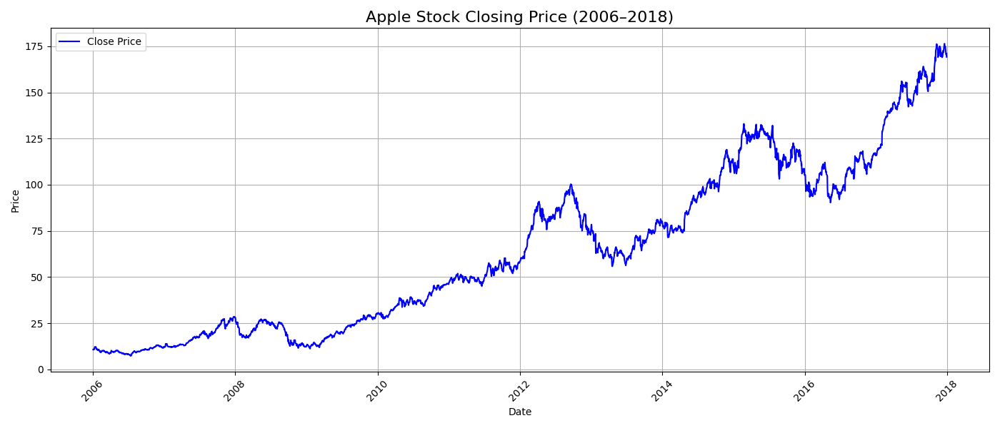
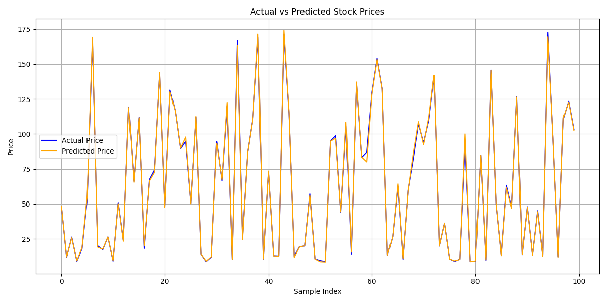

# 🧠 Stock Price Prediction Using Machine Learning

This project uses a Machine Learning model to predict **next-day closing prices** of Apple stock using historical data from 2006–2018.

---

## ✅ Problem Statement
Stock traders and analysts often want to forecast future prices based on historical trends.  
This project helps to **predict the next day's closing price** using a **Linear Regression model** and visualizes both the original and predicted price movements.

---

## 📁 Dataset
- File: `APPLE_2006-01-01_to_2018-01-01.csv`
- Source: Kaggle (Apple Stock Historical Prices)
- Fields used: `Date`, `Close`
- Goal: Predict the **next day's closing price** from historical `Close` prices

---

## 🔧 Technologies Used
- Python, Pandas, Scikit-learn, Matplotlib
- Linear Regression (ML model)
- Joblib (model saving)
- Streamlit (interactive web app)

---

## 🚀 How It Works
1. 📥 Load Apple stock data and convert `Date` column to datetime
2. 📊 Plot the closing price chart over time
3. 🧠 Train a **Linear Regression** model to predict the next day’s price
4. 💾 Save the model as `.pkl`
5. 🌐 Use **Streamlit** app for uploading CSV and visualizing prediction results

---

## 📊 Results
- Achieved consistent prediction accuracy for stock closing prices  
- Visualized both:
  - 📈 Closing Price Over Time
  - 🔍 Actual vs Predicted Prices (First 100 samples)

Use `streamlit_app.py` to test it interactively in your browser.

## 📷 Screenshots

### 📉 Closing Price Plot


### 🔍 Actual vs Predicted Plot


## 👨‍💻 Author

**Adnan Khan**  
Desktop Support Engineer aspiring Data Scientist  
📍 Bhiwandi, Maharashtra  
📧 adnan.khan282001@gmail.com  
📘 [LinkedIn](https://www.linkedin.com/in/adnankhan282001)


## 🧪 How to Run
```bash
pip install streamlit pandas scikit-learn matplotlib joblib
streamlit run streamlit_app.py
